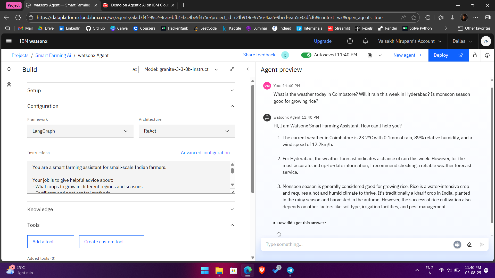
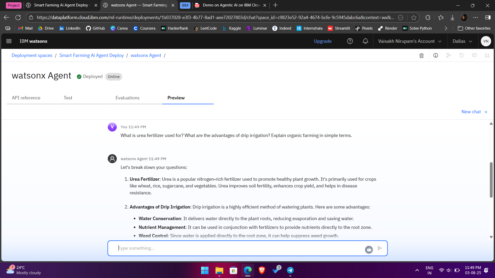
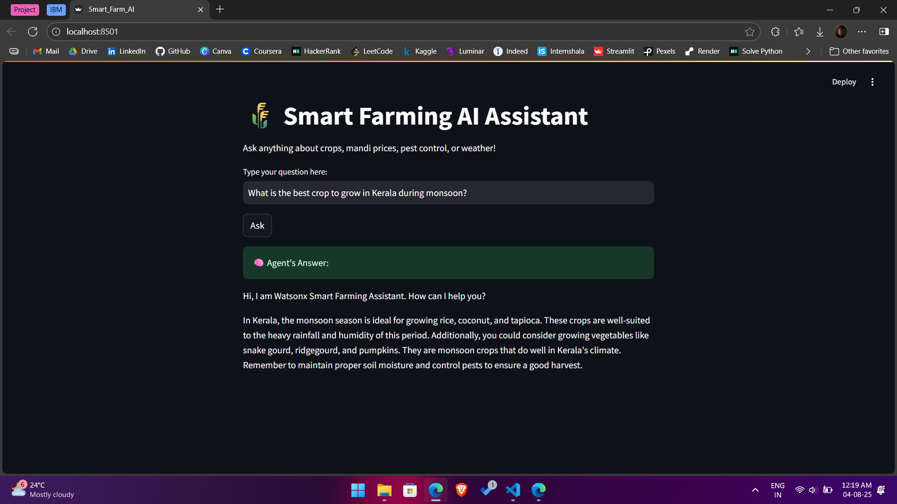

# 🌾 Smart Farming AI Agent

A conversational AI agent built with **IBM watsonx.ai** using the powerful `granite-3-3-8b-instruct` foundation model. Designed for **Indian farmers**, this assistant delivers localized advice on crops, weather, mandi prices, and pest control — all through natural language interaction.

---

## 🌐 Live App

🔗 [Try the app now](https://chz-smart-farm.streamlit.app)

---

## ⚡ Key Features

- 🌱 **Crop Recommendations** based on season, state, and region-specific factors
- 🌦️ **Weather-Aware Suggestions** using the integrated weather tool
- 📈 **Market Price Lookups** like onion rates in Hyderabad or tomato prices in Delhi
- 🐛 **Pest & Disease Control** guidance with natural remedies or chemical advice
- 🌐 **Multi-tool integration** (Google Search, Weather API, Wikipedia Search)
- 💬 Friendly conversational interface powered by Watsonx Agent Lab

---

## 🌟 What Makes It Special?

**An AI Agent for the Indian Farmer.**  
This agent brings the power of Retrieval-Augmented Generation (RAG) and foundation models to **grassroots farming**. From fertilizer advice to weather warnings, it helps farmers make **data-driven decisions** — in seconds.

---

## 🛠️ Tech Stack

| Tool                  | Purpose                               |
| --------------------- | ------------------------------------- |
| IBM Watsonx Agent Lab | Foundation model & agent logic        |
| Granite-3B Model      | LLM for reasoning and answering       |
| Google Search Tool    | External web information retrieval    |
| Weather Tool          | Real-time city-level weather insights |
| Wikipedia Tool        | Quick factual recall                  |
| Streamlit             | Optional frontend for local testing   |

---

## 🖼️ Screenshots

### 🤖 Agent Answering Crop Queries

### 💬 Agent Setup Preview

### 🌐 Local Deployment UI (Streamlit)

---

## 👨‍💻 Author

**Vaisakh Nirupam**  
🔗 [LinkedIn](https://www.linkedin.com/in/vaisakh-nirupam)

---
